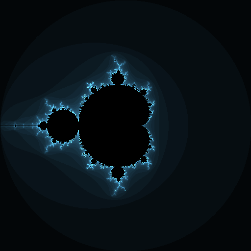

# Mandelbrot Set
The Mandelbrot Set is a fascinating program, and a personal 'Hello World' program for me to get familiar with a language.

## ASCII Renderer
### Example
```

                  **
                  **
               * *****
               *********
              **********
              **********
         *** ***********
        ****************
 **********************
        ****************
         *** ***********
              **********
              **********
               *********
               * *****
                  **
                  **
                  
```

## PNG Renderer
Using [Haskell Image Processing](http://hackage.haskell.org/package/hip), the Mandelbrot set simulation can be converted into a full colour PNG output!

This code wasn't a direct conversion - whereas the ASCII renderer is only a boolean, for a full colour renderer the number of iterations before escaping must also be tracked

Example usage:
```
renderMandelbrotPNG 50 512 (Mandelbrot.func_julia (0.285 :+ 0.01)) "julia.png"
```
Renders a 512x512 image of a the Julia set for the coordinates 0.285 + 0.01i

```
renderMandelbrotPNG 50 1024 Mandelbrot.func_mandelbrot "mandelbrot.png"
```
Renders a 1024x1024 image of the Mandelbrot set, using 50 iterations per pixel

### Possible Improvements
The program currently runs at an adequate speed - but I believe this could be done better. To help facilitate this, colors are now memoized.
I believe the next major speedup lies in *Mandelbrot.mandelbrot* - currently, each point is rendered to the maximum number of iterations. This is wasteful.
Future improvements could instead only render this up until the point escapes.

### Colors
My method for coloring the Mandelbrot Set involves a relatively simple calculation of just scaling each RGB channel by a constant. These constants generally create a simple tint of the image, with no fancy gradients.

Benefits of this method include: simpler calculations and glowier visuals

A common way of coloring the Mandelbrot set includes taking a log2 of the number of iterations. This creates smooth gradients, but I personally prefer the banded style.

### Example

